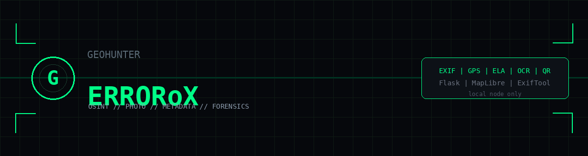
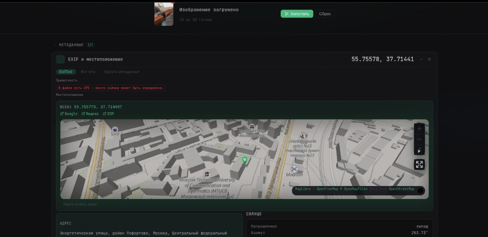
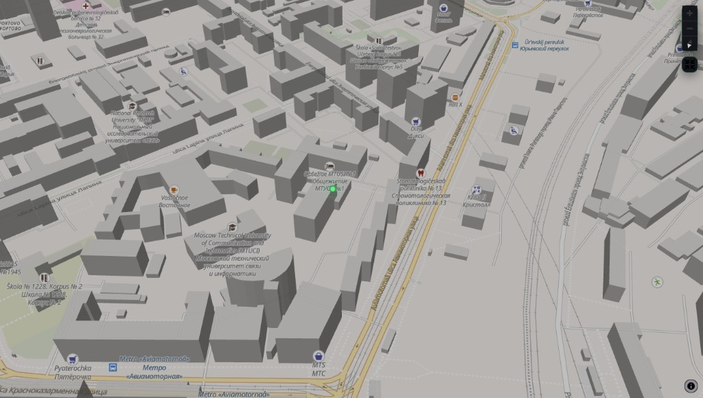
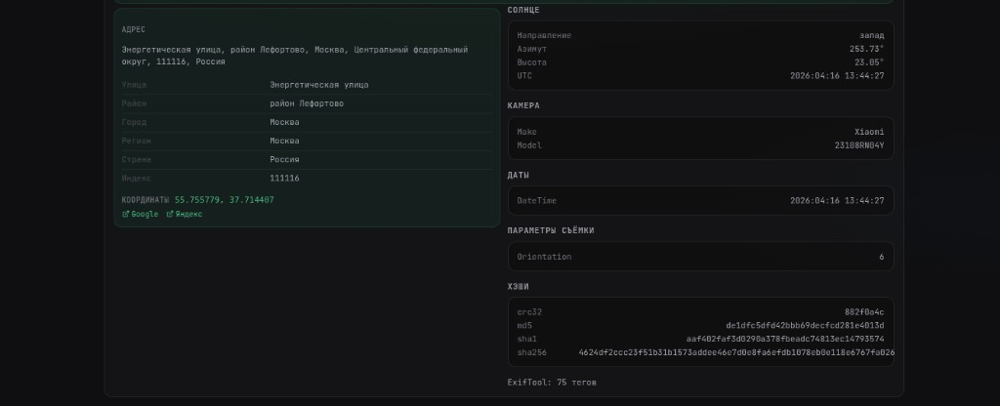
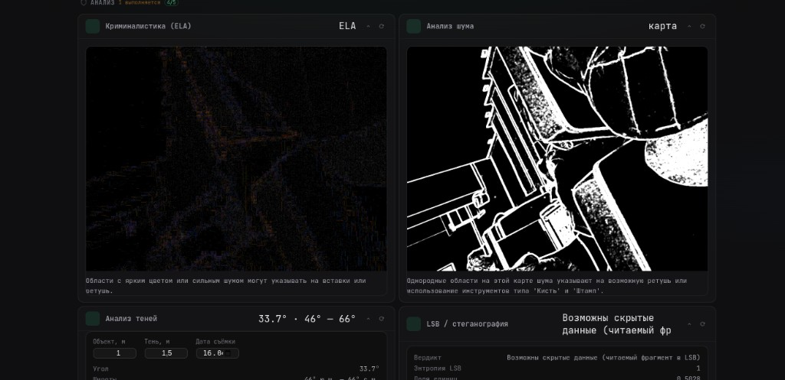

<p align="center">
  
</p>

```text
 ██████╗ ███████╗ ██████╗ ██╗  ██╗██╗   ██╗███╗   ██╗████████╗███████╗██████╗
██╔════╝ ██╔════╝██╔═══██╗██║  ██║██║   ██║████╗  ██║╚══██╔══╝██╔════╝██╔══██╗
██║  ███╗█████╗  ██║   ██║███████║██║   ██║██╔██╗ ██║   ██║   █████╗  ██████╔╝
██║   ██║██╔══╝  ██║   ██║██╔══██║██║   ██║██║╚██╗██║   ██║   ██╔══╝  ██╔══██╗
╚██████╔╝███████╗╚██████╔╝██║  ██║╚██████╔╝██║ ╚████║   ██║   ███████╗██║  ██║
 ╚═════╝ ╚══════╝ ╚═════╝ ╚═╝  ╚═╝ ╚═════╝ ╚═╝  ╚═══╝   ╚═╝   ╚══════╝╚═╝  ╚═╝
        [ LOCAL PHOTO OSINT NODE ] :: EXIF // GEO // FORENSICS // SIGINT-LITE
```

<h1 align="center">GeoHunter</h1>

<p align="center">
  <strong>Локальный фреймворк разбора изображений</strong><br>
  метаданные · геопривязка · криминалистика · текст · коды · follow-up поиск
</p>

<p align="center">
  <a href="https://www.instagram.com/_specter_X/"></a>
  
  
  
</p>

---

## /// BRIEFING

**GeoHunter** — мой рабочий стенд под фото-OSINT: один снимок → метаданные, координаты, карта, следы монтажа, шум, тени, LSB, лица, OCR, QR и ссылки на обратный поиск.  
Всё крутится **на вашем хосте** (Flask). Файл в облако для «магического анализа» не уходит.

```bash
# после run.py
http://127.0.0.1:5050/photo/
```

> **OPSEC:** геокод шлёт координаты на Nominatim; карта тянет тайлы из сети. Учитывайте это в чувствительных кейсах.

---

## /// VISUAL [FIELD REPORT]

<p align="center"><b>01 — EXIF / GPS / MAP</b> · точка, адрес, предупреждение о геотеге</p>

<p align="center">
  
  
</p>

<p align="center"><b>02 — METADATA PANEL</b> · адрес, солнце, камера, хэши</p>

<p align="center">
  
</p>

<p align="center"><b>03 — FORENSICS SUITE</b> · ELA · NOISE · SHADOWS · LSB</p>

<p align="center">
  
</p>

---

## /// MODULE MANIFEST

| MOD | Назначение | Стек |
|-----|------------|------|
| `EXIF` | GPS, WGS84, геокод, карта, ExifTool, ссылки на карты | exiftool, Nominatim, MapLibre |
| `ELA` | Error Level Analysis — зоны пересохранения / ретуши | Pillow |
| `NOISE` | карта шума — неоднородность по кадру | NumPy, SciPy |
| `SHADOW` | азимут солнца, оценка широты по тени + EXIF-время | Astral |
| `LSB` | младшие биты, намёк на стеганографию | Pillow |
| `FACE` | детекция лиц | OpenCV |
| `OCR` | текст, email, телефоны, URL | Tesseract rus+eng |
| `QR` | QR / штрихкоды | pyzbar |
| `REV` | Lens, Яндекс, Bing, TinEye — ручной follow-up | браузер |
| `SEARCH` | готовые запросы из EXIF/OCR | браузер |

**Сервис:** экспорт MD/JSON · JPEG без EXIF · полный дамп тегов ExifTool.

---

## /// DEPLOY [LOCAL NODE]

**Требования:** Python 3.10+ · Linux / macOS / WSL

```bash
sudo apt update
sudo apt install -y python3 python3-venv python3-pip \
  exiftool tesseract-ocr tesseract-ocr-rus tesseract-ocr-eng \
  libzbar0 libgl1
```

```bash
git clone <url> GeoHunter && cd GeoHunter
python3 -m venv venv && source venv/bin/activate
pip install -r requirements.txt
python3 run.py
```

Проверка бинарников:

```bash
exiftool -ver && tesseract --version
```

Если `python3` не системный:

```bash
/usr/bin/python3.13 run.py
```

Конфиг: `.env` ← `.env.example` (`PORT`, `MAX_UPLOAD_MB`, `SECRET_KEY`, …).

---

## /// OPERATOR WORKFLOW

1. **INGEST** — файл или URL в `/photo/`.
2. **RUN** — параллельный прогон всех модулей.
3. **TRIAGE** — EXIF (карта + адрес), forensics, OCR/QR, search links.
4. **EXPORT** — MD/JSON из шапки после прогона.
5. **SANITIZE** — «Удалить метаданные» → чистая копия JPEG.

**Заметки по полю:**

- GPS часто срезан мессенджерами — нужен **оригинал с камеры**.
- Белая карта → нет сети / блок CDN MapLibre / OpenFreeMap.
- 413 → поднять `MAX_UPLOAD_MB`.

---

## /// API [HEADLESS]

`POST` · JSON · поле `imageBase64`

```
/api/exif              — метаданные + GPS + геокод
/api/exif/strip        — JPEG без EXIF
/api/exif/exiftool/json
/api/forensics/ela | noise | stego | faces | shadow-solve
/api/ocr | /api/qr-barcode
/api/reverse-search | /api/search
/api/export-report | /api/export-json
```

```bash
curl -s -X POST http://127.0.0.1:5050/api/exif \
  -H "Content-Type: application/json" \
  -d "{\"imageBase64\":\"$(base64 -w0 target.jpg)\",\"exiftool\":true,\"geocode\":true}"
```

Полный конфиг: `backend/config.py`.

---

## /// TREE

```
run.py
backend/           # routes, services, tools/
static/photo/      # operator UI
tools/exif_inspector/
docs/              # banner.png, screenshots/
LICENSE            # MIT © ERRORoX
```

Расширение: `backend/tools/` → `registry.py` → `routes.py` → `tools-config.js`.

---

## /// TROUBLESHOOT

| SYMPTOM | FIX |
|---------|-----|
| no exiftool | `apt install libimage-exiftool-perl` |
| OCR null | `tesseract-ocr-rus` |
| QR dead | `libzbar0` |
| FACE off | `pip install opencv-python-headless` |
| map blank | F12 → network; check openfreemap + unpkg |
| no GPS pin | EXIF без координат |

Стартовый лог: `env_check.py`.

---

## /// OPERATOR

<table>
  <tr>
    <td><b>CALLSIGN</b></td>
    <td><b>ERRORoX</b></td>
  </tr>
  <tr>
    <td><b>COMMS</b></td>
    <td>
      <a href="https://www.instagram.com/_specter_X/">Instagram @_specter_X</a>
    </td>
  </tr>
  <tr>
    <td><b>ROLE</b></td>
    <td>author · maintainer · GeoHunter</td>
  </tr>
</table>

Баги и идеи — issues или DM. В репорте: ОС, `python3 --version`, `exiftool -ver`, stderr + F12.

---

## /// LEGAL

**[MIT License](LICENSE)** — © 2026 **ERRORoX**

Анализируйте только то, на что есть право. Не светите инстанс в open internet без auth/TLS/ротации `SECRET_KEY`. Вывод модулей — **гипотеза для проверки**, не вердикт.

```text
[ EOF ] :: stay sharp :: ERRORoX :: @_specter_X
```
